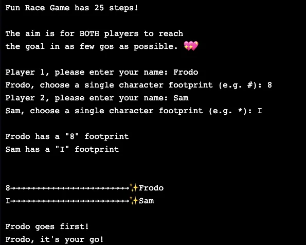
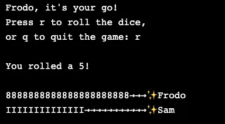
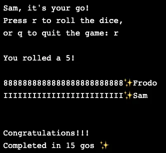

# Fun Race Game

I’m taking Codecademy's Computer Science Career Path and part of the course is writing a simple in Python game. 

I wanted to create a collaborative game so created a race where the aim is for two players to BOTH finish in as few gos as possible.

I really enjoyed coding, testing and then playing the game once it was finished. 

Below are a few screenshots of a game in action. 
Download [fun-race-game.py](https://github.com/gracekishino/python_fun_race_game/blob/main/fun-race-game.py) if you’d like to play it! 🥰

## Game intro and setting up users

## User having a go

## Game Completion

